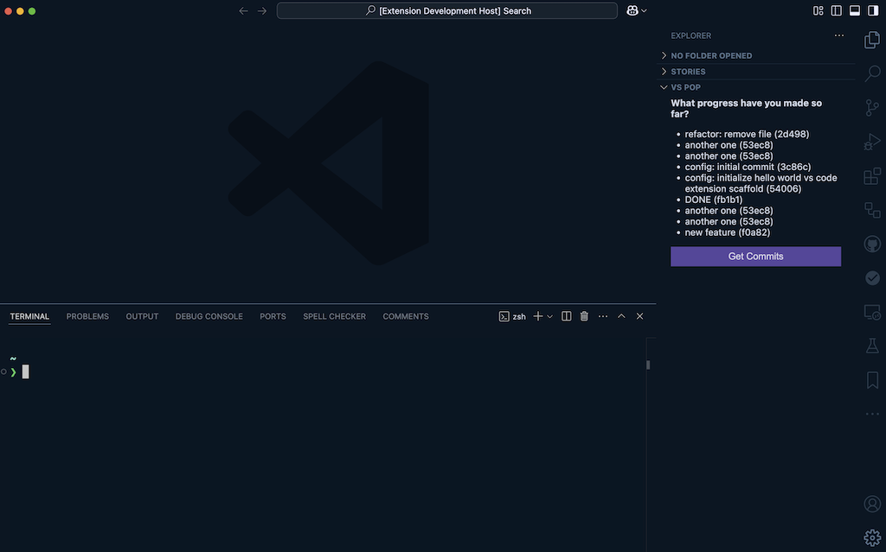

# 📈 VS POP Extension (v0.0.1-alpha)

This is a VS Code extension inspired by the "progress over perfection" (POP) principle. Most productivity tools are focused merely on outcomes, but those rarely reflect the true effort that developers make in their day to day.

You can check out the [official docs here](https://vs-pop-extension.netlify.app/).

## 🧰 Prerequisites

- [Visual Studio Code](https://code.visualstudio.com/)
- Familiarity with basic [Git](https://git-scm.com/) commands

## 📖 How to Use

1. Clone repository
2. Open `extension.js`
3. Run `Debug: Start Debugging` command
   - Press `F5`
   - Run command from command palette
   - Use top navigation `Run > Start Debugging`
4. If a dropdown opens up to select the debugger context, select the one for `VS Code Extensions`
5. This should open up a debugger workspace in a new window
6. You should see a VS POP panel
7. Add a folder that is an existing git project to the debugger workspace
8. Add commits to the project which should trigger notifications that work is being tracked
9. Click "Get Commits" in the VS POP panel to see work that's been accomplished
10. This data should persist as you close the workspace and/or add new projects

## ✨ Features

The early alpha version of this extension contains the ability to:

1. Track git commits and persist the state across working sessions
2. Display commits in a list view with the message and commit id displayed

## 🐞 Known Issues

There is currently a data duplication issue that will be resolved in a future patch.
